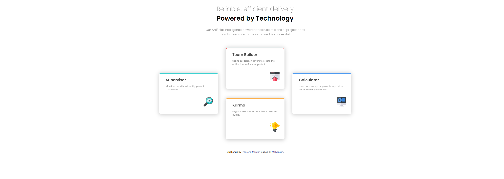

# Frontend Mentor - Four card feature section solution

This is a solution to the [Four card feature section challenge on Frontend Mentor](https://www.frontendmentor.io/challenges/four-card-feature-section-weK1eFYK). Frontend Mentor challenges help you improve your coding skills by building realistic projects. 

## Table of contents

- [Overview](#overview)
  - [The challenge](#the-challenge)
  - [Screenshot](#screenshot)
  - [Links](#links)
- [My process](#my-process)
  - [Built with](#built-with)
  - [What I learned](#what-i-learned)
  - [Continued development](#continued-development)
  - [Useful resources](#useful-resources)
- [Author](#author)
- [Acknowledgments](#acknowledgments)

## Overview

### The challenge

Users should be able to:

- View the optimal layout for the site depending on their device's screen size

### Screenshot



Four card feature section showing Supervisor, Team Builder, Karma, and Calculator cards arranged in a grid on a clean white background. Each card contains an icon, a heading, and a short description: Supervisor monitors activity to identify project roadblocks, Team Builder scans our talent network to create the optimal team for your project, Karma regularly evaluates our talent to ensure quality, Calculator uses data from past projects to provide better delivery estimates. The page header reads Reliable efficient delivery Powered by Technology. The overall tone is professional and modern.

Alternatively, you can use a tool like [FireShot](https://getfireshot.com/) to take the screenshot. FireShot has a free option, so you don't need to purchase it. 

Then crop/optimize/edit your image however you like, add it to your project, and update the file path in the image above.

**Note: Delete this note and the paragraphs above when you add your screenshot. If you prefer not to add a screenshot, feel free to remove this entire section.**

### Links

- Solution URL: [Add solution URL here](https://your-solution-url.com)
- Live Site URL: [Add live site URL here](https://your-live-site-url.com)

## My process

### Built with

- Semantic HTML5 markup
- CSS custom properties
- Flexbox
- CSS Grid
- Mobile-first workflow
- [React](https://reactjs.org/) - JS library
- [Next.js](https://nextjs.org/) - React framework
- [Styled Components](https://styled-components.com/) - For styles

**Note: These are just examples. Delete this note and replace the list above with your own choices**

### What I learned

Use this section to recap over some of your major learnings while working through this project. Writing these out and providing code samples of areas you want to highlight is a great way to reinforce your own knowledge.

To see how you can add code snippets, see below:

```html
 <section class="masterContainer">
      <section class="containerS">
        <h3 class="super">Supervisor</h3>
        <p class="sPara">Monitors activity to identify project roadblocks</p>
        
      </section>

      <section class="jointContainer">
        <section class="containerT">
          <h3 class="team">Team Builder</h3>
          <p class="tPara">Scans our talent network to create the optimal team for your project</p>
          
        </section>

        <section class="containerK">
          <h3 class="karma">Karma</h3>
          <p class="kPara">Regularly evaluates our talent to ensure quality</p>
          
        </section>
      </section>

      <section class="containerC">
        <h3 class="calc">Calculator</h3>
        <p class="cPara">Uses data from past projects to provide better delivery estimates</p>
        
      </section>
    </section>
```
Handled multiple sections (representing 4 cards).

```css
.proud-of-this-css {
  color: papayawhip;
}
```

### Continued development

Use this section to outline areas that you want to continue focusing on in future projects. These could be concepts you're still not completely comfortable with or techniques you found useful that you want to refine and perfect.

**Note: Delete this note and the content within this section and replace with your own plans for continued development.**

### Useful resources

- [MDN Web Docs](https://developer.mozilla.org/en-US/docs/Web/CSS/box-shadow) - This helped me understand box shadow.
- [Google Fonts](https://fonts.google.com/selection/embed) - This one helped me embed the Font in my script.

## Author

- Frontend Mentor - [@Mohaniish2208](https://www.frontendmentor.io/profile/Mohaniish2208)

## Acknowledgments

This is where you can give a hat tip to anyone who helped you out on this project. Perhaps you worked in a team or got some inspiration from someone else's solution. This is the perfect place to give them some credit.

**Note: Delete this note and edit this section's content as necessary. If you completed this challenge by yourself, feel free to delete this section entirely.**
